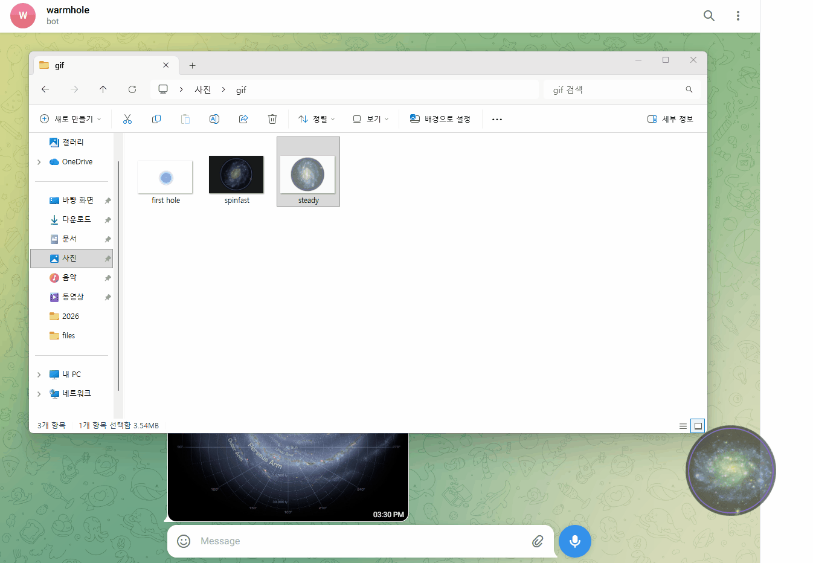

# 🌌 Wormhole File Transfer

**"나에게" 보내기 귀찮으시다구요?**

이제 웜홀에 가져다 던지세요! 파일을 드래그하면 간편하고 빠르게 파일을 보낼 수 있습니다. 이 앱은 telegram api를 활용하여 제작되었습니다.

---

## 1. Overview (기능 요약)
* **Drag & Drop 전송:** 어떤 파일이든 웜홀 위젯으로 드래그하면 즉시 내 텔레그램으로 전송됩니다.
* **Auto Environment:** Python만 설치되어 있다면 `run.bat` 또는 `run.sh` 파일 더블클릭 한 번으로 가상환경 구축부터 실행까지 자동으로 완료됩니다.
* **Customizing:** 설정창을 통해 위젯의 투명도와 기본 회전 속도를 자유롭게 조절할 수 있습니다.

---

## 2. Installation (설치 및 실행)

### 1) Python 환경설치
이 프로그램은 `python=3.11`에서 제작되었습니다. \
다른 버전에서도 구동 가능하나 호환성을 고려하여 이 버전으로 설치하여 주세요.

### 2) Telegram 봇 개설
프로그램을 사용하기 위해 전송 통로가 될 봇을 준비해야 합니다.
1. 텔레그램에서 **@BotFather**를 검색하여 대화를 시작합니다.
2. `/newbot` 명령어로 봇을 생성하고 **Bot Token**을 발급받습니다.
3. 내 **Chat ID**를 확인합니다. (확인 방법: `@userinfobot` 등 활용)
4. 발급받은 **Token**과 **Chat ID**를 프로그램 최초 실행 시 뜨는 설정창에 입력하세요.

### 3) 운영체제별 실행 방법
> **참고:** 본 프로그램은 GUI 기반 위젯이므로 터미널만 있는(Headless) 환경에서는 실행할 수 없습니다.

* **Windows 🪟**
  - 프로젝트 폴더 내의 `run.bat` 파일을 더블 클릭합니다.
* **Linux / macOS 🍎🐧**
  - 터미널을 열고 `./run.sh`를 실행합니다.
  - (권한 에러 발생 시: `chmod +x run.sh` 명령어를 먼저 입력하세요.)

---

## 3. How to use? (사용 방법)

### 1) 파일 및 텍스트 전송
* 전송할 파일이나 이미지를 마우스로 끌어서 화면의 **보라색 웜홀 위젯** 위에 놓으세요.
* 전송 중에는 웜홀이 가속되며, 전송 완료 시 시스템 트레이 알림이 표시됩니다.

### 2) 메시지 및 클립보드 확인
* **웜홀 위젯의 테두리를 더블 클릭**하세요.
* 연결된 텔레그램 챗봇 방이 즉시 열리며, 전송 내역 확인이나 텍스트 복사가 가능합니다.

---

## 4. Settings (상세 설정)

### 1) 환경 설정 (Settings)
* **Bot Token / Chat ID:** 텔레그램 연동 정보를 수정합니다.
* **Opacity (투명도):** 위젯의 투명도를 조절하여 작업에 방해되지 않게 설정합니다.
* **Rotation Speed (회전속도):** 웜홀의 기본 회전 속도를 취향에 맞게 설정합니다.

### 2) 시스템 트레이 (System Tray)
* 작업표시줄 아이콘을 우클릭하여 다음 기능을 사용할 수 있습니다.
  - **웜홀 보이기/숨기기:** 위젯을 잠시 숨기거나 다시 보이기
  - **설정:** 설정 다이얼로그 열기
  - **종료:** 프로그램 완전히 종료

---

## 5. Copyrights
* 본 프로젝트는 **MIT License**를 따릅니다. 
* 누구나 자유롭게 수정 및 재배포가 가능합니다.

## 6. Credits
- `src/assets/andromeda.jpg`

 \
Captured by **NASA/JPL-Caltech/Univ. of Ariz. (Spitzer Space Telescope)** \
(https://images.nasa.gov/details/PIA07828)