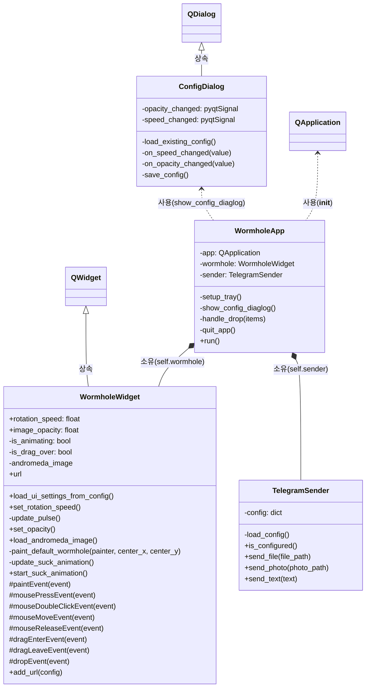

```mermaid
classDiagram

    class ConfigDialog {
        -opacity_changed: pyqtSignal
        -speed_changed: pyqtSignal

        %% Configure
        -load_existing_config()

        %% Speed & Opacity
        -on_speed_changed(value)
        -on_opacity_changed(value)
        -save_config()
        
    }

    class WormholeApp {
        -app: QApplication
        -wormhole: WormholeWidget
        -sender: TelegramSender

        %% Setup
        -setup_tray()
        -show_config_diaglog()

        %% Action
        -handle_drop(items)

        %% Application run & close
        -quit_app()
        +run()
    }

    class WormholeWidget {
        +rotation_speed: float
        +image_opacity: float
        -is_animating: bool
        -is_drag_over: bool
        -andromeda_image
        +url

        %% 이미지 불러오기 및 설정 메서드
        +load_ui_settings_from_config()
        +set_rotation_speed()
        -update_pulse()
        +set_opacity()
        +load_andromeda_image()
        -paint_default_wormhole(painter, center_x, center_y)

        %% 애니메이션 관련 메서드
        -update_suck_animation()
        +start_suck_animation()

        %% 이벤트
        #paintEvent(event)
        #mousePressEvent(event)
        #mouseDoubleClickEvent(event)
        #mouseMoveEvent(event)
        #mouseReleaseEvent(event)
        #dragEnterEvent(event)
        #dragLeaveEvent(event)
        #dropEvent(event)

        %% 더블클릭 시 해당 챗봇방 이동을 위해 url을 제공하는 메서드
        +add_url(config)

    }

    class TelegramSender {
        -config: dict

        %% Configure
        -load_config()
        +is_configured()

        %% Action
        +send_file(file_path)
        +send_photo(photo_path)
        +send_text(text)
    }

    %% 상속 관계 (Generalization)
    QWidget <|-- WormholeWidget : 상속
    QDialog <|-- ConfigDialog : 상속

    %% 합성 관계 (Composition) - App이 __init__() 시 객체 소유 및 생명주기 or 로직 관리
    WormholeApp *-- WormholeWidget : 소유(self.wormhole)
    WormholeApp *-- TelegramSender : 소유(self.sender)

    %% 의존 관계 (Dependecy) - 메서드 내 일시적으로 사용
    ConfigDialog <.. WormholeApp : 사용(show_config_diaglog)
    QApplication <.. WormholeApp : 사용(__init__)

```