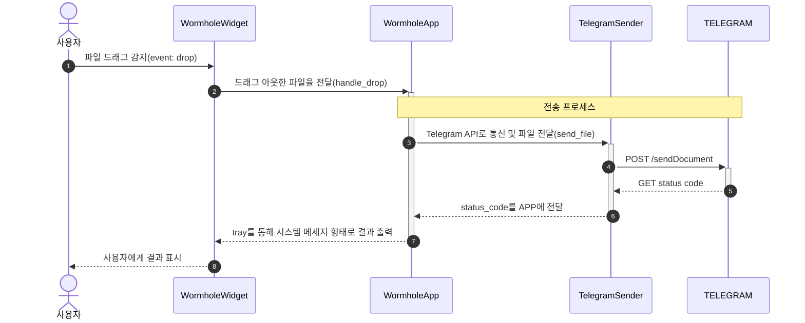

```mermaid
sequenceDiagram
    autonumber

    %% ROLES

    %% Actor: 사람
    actor User as 사용자

    %% Interface: QtWidget 기반 클래스
    participant UI as WormholeWidget

    %% Control: QApplication 클래스
    participant APP as WormholeApp
    
    %% Service: 실제 기능 담당 클래스
    participant API as TelegramSender

    %% Infra-structure: 이 코드 시스템 외 필요한 요소
    participant Infra as TELEGRAM


    %% METHODS

    %% 1. 파일 및 클립보드가 드래그되어 아이콘 위로 옴을 감지
    User->>UI: 파일 드래그 감지(event: drop)

    %% 2. 드래그 아웃 감지되면 해당 파일을 Telegram을 통해 전달
    UI->>+APP: 드래그 아웃한 파일을 전달(handle_drop)
    
    Note over APP, Infra: 전송 프로세스
    APP->>+API: Telegram API로 통신 및 파일 전달(send_file)
    API->>+Infra: POST /sendDocument

    %% 3. 전달 여부 메세지 표시 및 초기화
    Infra-->>-API: GET status code
    API-->>-APP: status_code를 APP에 전달
    APP-->>-UI: tray를 통해 시스템 메세지 형태로 결과 출력
    UI-->>User: 사용자에게 결과 표시
    
```